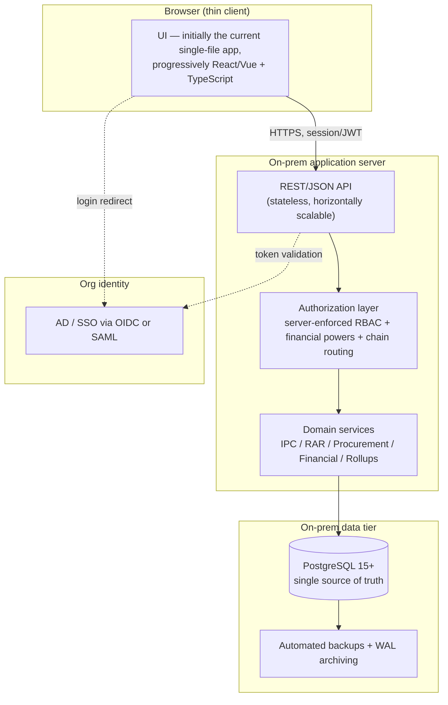

# FGEHA × NLC Unified Project Control — Target Architecture & Data Model

**Document type:** Backend blueprint for the implementation team
**Source app:** `FGEHA_NLC_F14F15_UnifiedControl_v1_43_0.html` (single-file prototype, verified 1,185/1,186 tests green)
**Companion artifact:** `fgeha_nlc_schema.sql` (PostgreSQL 15+ DDL, validated against the real PostgreSQL grammar)
**Status:** Draft v1 for review. Some decisions are deliberately left open (see §11) — they need a stakeholder call, not a guess.

---

## 1. Purpose and scope

This document is the bridge between what exists today — a self-contained browser application that holds all of its data, identity and trust in the client — and the agreed end state: a secure, multi-user, on-premise **system of record** for FGEHA/NLC.

It is written for whoever builds the backend. It does three things: describes the current and target shapes, defines a normalized PostgreSQL data model derived directly from the app's live `state` object, and lays out an incremental migration that keeps the existing UI working at every step. It is explicitly *not* a big-bang rewrite plan; the agreed direction is to stand up a server and database underneath the current UI first, then peel screens into a framework over time.

What stays the same after conversion: every feature and screen users rely on today — the org hierarchy, BOQ/IPC/RAR registers, financials, mapping, command dashboards, exports, comments. What changes underneath: where data lives, who is trusted to enforce permissions, and how the codebase is maintained.

## 2. The conversion in one paragraph

Today, persistence is browser `localStorage`, identity is a role value stored in that same browser, and access control is computed client-side and is therefore advisory only — anyone with developer tools can change their role. Enterprise readiness is mostly a server problem: move persistence to a shared PostgreSQL database with backups and concurrency; move identity to real authentication via the organization's AD/SSO; and move authorization from client code to **server-enforced** RBAC. The UI becomes a thin client over an API. None of the domain logic the prototype already proved needs to be thrown away — it gets re-expressed against a database and an authorization boundary.

## 3. Current ("as-is") architecture

The prototype is one HTML file of roughly 1.5 MB with all CSS, JavaScript and vendor libraries (Chart.js, SheetJS, mathjs) inlined. It runs from `file://` or any static host with no build step.

All state lives in a single in-memory `state` object, persisted on a 400 ms debounce to `localStorage` under the key `fgeha_nlc_unified_v1`, with JSON backup/restore for moving data between machines. The object is sliced into `commercial`, `financial`, `execution`, `mapping`, `procurement`, `org`, `session`, `ui`, `auditLog` and `meta`.

A notable shape detail: the app supports many projects but keeps only the **active** project's working data in the top-level slices (`state.commercial`, `state.financial`, etc.), while every inactive project's data sits stashed in `state.org.projects[id].data`. Switching projects swaps the stash in and out. This "working-set + stash" trick let the prototype make ~936 existing single-project readers project-aware with almost no churn — but it is a client-memory optimization with no place in a server model, where every project's data is always individually addressable. The target schema (§6) dissolves that distinction entirely.

Access control is the critical gap. Roles, the project-access matrix, financial-power thresholds and approval-chain routing are all evaluated in the browser. They shape the UI correctly for a cooperative user, but they are not a security boundary.

## 4. Target ("to-be") architecture

A conventional three-tier application deployed entirely inside the organization's network:



The server is stateless so it can run as more than one instance behind the org's load balancer. Authorization is a distinct layer that every mutating call passes through; it is where the client-side `canDo` / `requireRole` / `canAccessProject` / financial-power checks are re-implemented as the *real* gate. PostgreSQL is the single source of truth, with point-in-time recovery via WAL archiving.

Deployment is on-prem / private cloud for government data-residency, with the usual dev / staging / production environments, monitoring, and disaster-recovery procedures. The server stack itself is an open decision (§11) — the data model and API contract below are stack-neutral.

## 5. Authorization model (the heart of "enterprise")

The prototype already encodes a rich permission model; the work is to enforce it server-side rather than replace it.

There are three independent axes, and an action is permitted only when **all three** pass:

1. **Action × role** — the global `PERMISSIONS` map: ~79 permission keys (e.g. `proc.demand.raise`, `ipc.vet`) each granting a set of roles. Modeled as `role_permission`.
2. **Project × role** — per-project membership: which roles may touch a given project at all. Modeled as `project_access`. `admin` bypasses. The current app computes this as an intersection with the action gate; the server keeps that intersection semantics.
3. **Amount × role (financial powers)** — for procurement, the approving role must have a `financial_power` threshold at or above the document value (`dg` is unlimited). Modeled as `financial_power`.

On top of those, **approval-chain routing** decides *which* role performs *each stage* of a procurement or payment document. The global chains live in `approval_chain_stage`; a project may override the role(s) for a specific action via `project_action_override` (the app's sparse `project.approvalChain`). The authorization layer resolves the effective role for a stage as "project override if present, else global default, with `admin` always retained."

Identity comes from AD/SSO. A user authenticates against the org IdP (OIDC or SAML); the server maps the IdP subject to an `app_user` row and reads that user's `user_role` grants. Crucially, a grant may be **scoped to an org node** — a PD-North Project Manager holds `pm` scoped to `pd-north` — which is how the NLC hierarchy (HQ-level / PD-level / Project-level roles) becomes expressible, something the single browser role toggle could never represent.

## 6. Data model

The full DDL is in `fgeha_nlc_schema.sql` (47 tables, 9 enums, an append-only audit trigger, and seed data for roles, the org tree, financial powers and chain definitions). It targets PostgreSQL 15+. Highlights and the reasoning behind the non-obvious choices:

**Money is `NUMERIC(20,4)`, never floating point.** The command dashboards sum money across many projects; exact decimal arithmetic is required to make roll-ups reconcile to the penny, which is a property the prototype's tests already assert.

**The org tree is an adjacency list** (`org_node` with a self-referencing `parent_id`) carrying a `node_type` enum of `hq | hq_engrs | pd_hq | project`. The fixed three-level shape is a business rule enforced in the service layer, not a database CHECK, so the structure can evolve without a migration.

**Project data is fully normalized — the working-set/stash split disappears.** Every IPC, RAR, receipt, payment, demand, etc. carries a `project_id` and is always directly queryable. What the prototype expressed by swapping slices in and out of memory, the database expresses with a foreign key and an index.

**Stable in-app identifiers are preserved.** Surrogate `BIGINT` identity keys are used everywhere for joins, but human/app-facing identifiers (`ipc_no` = `IPC-01`, `demand_no` = `DEM-0001`, role keys, permission keys, org-node ids) are kept as natural columns so the migration is lossless and audit trails stay legible.

**A few genuinely document-shaped fields stay as `JSONB`** — IPC deduction breakdowns, RAR allocation selections (which the app keys by *allocation* id, not BOQ id — a documented pitfall the schema's comment preserves), commercial settings, and per-user UI preferences. These are read and written as a unit and have no cross-row query needs, so columnizing them would add churn without benefit. Everything that is aggregated, filtered, or joined is a real column.

**The audit log is append-only at the database layer.** `audit_log` has a trigger that raises on any UPDATE or DELETE, making the compliance trail immutable rather than merely conventionally append-only as it is in the browser today.

**User-specific UI state is separated from shared data.** RAG thresholds, filters, recent-nodes and theme are per-user preferences (`user_pref`), not project data — so one user's filter never mutates another's view.

### State slice → schema mapping

| App `state` slice | Tables |
|---|---|
| `state.org.tree` | `org_node` |
| `state.org.projects[id]` (minus `.data`) | `project`, `project_access`, `project_action_override` |
| `project.boq` | `boq_bill`, `boq_item` |
| `project.scurve`, `project.schedule` | `scurve_point`, `schedule_activity` |
| `state.commercial` (ipcs/rars/epcs/subs/distributions/advances/settings) | `ipc`, `ipc_line`, `rar`, `rar_ipc_link`, `epc`, `subcontractor`, `distribution`, `allocation`, `advance`, `commercial_settings` |
| `state.financial` (receipts/payments/liabilities/plannedOverheads) | `financial_receipt`, `financial_payment`, `financial_liability`, `planned_overhead` |
| `state.execution` (monthly/store/plant/equipment) | `execution_monthly`, `execution_resource` |
| `state.mapping` | `boq_to_wbs`, `boq_to_material` |
| `state.procurement` | `demand`, `demand_item`, `purchase_order`, `crv`, `proc_payment`, `machinery_hire`, `machinery_utilization`, `material_issue`, `production_run`, `supplier`, `financial_power` |
| `APPROVAL_CHAINS` + `doc.stageHistory` | `approval_chain_stage`, `approval_event` |
| `state.comments[nodeId]` | `node_comment` |
| `state.auditLog` | `audit_log` (immutable) |
| `state.session` + AD/SSO | `app_user`, `role`, `permission`, `role_permission`, `user_role` |
| per-user `state.ui` (ragThresholds/filters/scurveHide/recentNodes/theme) | `user_pref` |

## 7. API surface (preview)

The first server milestone replaces `localStorage` with the smallest possible API: load and save the whole state document for a project. That is low-risk and unblocks multi-user persistence immediately.

```
GET  /api/projects/{id}/state        -> the project's full state document (server-assembled)
PUT  /api/projects/{id}/state        <- whole-document save (optimistic-locked by version)
```

It then decomposes into per-entity endpoints as screens are refactored, all subject to the §5 authorization layer:

```
GET    /api/projects                         list (scoped to caller's accessible projects)
GET    /api/projects/{id}                     project + salients
GET    /api/projects/{id}/ipcs                IPC register
POST   /api/projects/{id}/ipcs                create IPC          (gate: ipc.create)
POST   /api/ipcs/{ipcId}/transitions          advance pipeline    (gate: ipc.<action>)
GET    /api/nodes/{nodeId}/rollup             command dashboard roll-up (access-scoped)
POST   /api/demands/{id}/advance              walk approval chain (gate: resolved stage role + financial power)
...    (RAR, procurement, financial, mapping, comments follow the same pattern)
```

Every mutating endpoint writes an `audit_log` row server-side; the client can no longer be trusted to record its own audit trail.

## 8. Migration strategy (incremental, the app keeps working throughout)

```mermaid
sequenceDiagram
    participant U as User (existing UI)
    participant S as Server + API
    participant DB as PostgreSQL
    Note over S,DB: M1 — backbone deployed (no user-visible change)
    Note over U,DB: M2 — persistence cutover
    U->>S: PUT /projects/{id}/state (was localStorage.setItem)
    S->>DB: upsert normalized rows
    U->>S: GET /projects/{id}/state (was localStorage.getItem)
    S->>DB: assemble + return
    Note over U,S: M3 — AD/SSO login; server enforces RBAC
    Note over U,S: M4 — security complete (escaping audit, validation, immutable audit)
    Note over U,S: M5+ — screens move to framework; scale & ops; integrations
```

1. **Backbone** — server + PostgreSQL deployed on-prem; load `fgeha_nlc_schema.sql`. No user-visible change yet.
2. **Shared persistence** — swap the app's `saveState`/`loadState` for the two state endpoints. This is the single biggest jump in value: data becomes central, backed up and multi-user. The existing JSON backup files (`FGEHA-NLC_Demo_Backup.json`) are the migration fixture — a one-time importer parses a backup and writes the normalized rows, idempotently.
3. **Auth + server RBAC** — wire AD/SSO; move the three authorization axes and chain routing server-side. The browser role toggle becomes a read-only display of the authenticated identity.
4. **Security complete** — finish the app-wide HTML-escaping audit of the original render functions (the write-time sanitizer is pass 1; the render-layer audit remains), add input validation, secure transport and secrets management, and rely on the immutable server audit log.
5. **UI refactor** — peel screens out of the single file into a framework + TypeScript + CI, retiring the Python merger build process.
6. **Scale & ops** — pagination and indexing for hundreds-to-thousands of projects, monitoring, environments, DR.
7. **Integrations & BI** — accounting/ERP, Primavera/MS Project schedules, document storage, notifications, scheduled reports.

At every milestone the system is usable; nothing requires a cutover weekend.

A practical note on the data migration: because the schema preserves every in-app identifier and the prototype's numbers already reconcile under test, the importer can be validated by round-tripping — import a backup, re-assemble the state document via the API, and assert it matches the dashboards the prototype produces from the same backup.

## 9. Non-functional requirements

Concurrency with central, backed-up storage; real authentication (AD/SSO) and server-enforced authorization; closed XSS sinks with input validation and CSRF/transport protection and proper secrets management; an immutable audit trail; performance at scale via server-side queries, pagination and indexing; accessibility (WCAG), responsive/mobile and i18n-readiness (English + Urdu is on the backlog); and a maintainable codebase with automated tests, CI/CD, multiple environments and monitoring.

## 10. What this preserves

The functional surface is unchanged. The 44 smoke-test suites that guard the prototype's behavior remain the executable specification of what the domain logic must do; as services are built, their outputs should be checked against the same assertions (IPC pipeline transitions, RAR allocation keying, cumulative CRV over-receipt detection, roll-up reconciliation, RAG thresholds). The prototype is, in effect, a working reference implementation of the business rules.

## 11. Open decisions (need a stakeholder call, not a default)

These genuinely change the build and should not be guessed:

1. **Server stack.** Node/Express, .NET, Java/Spring, or Python/FastAPI? Drives the reference scaffold and the team's skills fit. The data model and API contract above are deliberately stack-neutral so this can be decided independently.
2. **AD/SSO protocol and attribute mapping.** OIDC vs SAML, and how directory groups map to `user_role` grants and their node scopes.
3. **Schema ownership of migrations.** Hand-written SQL migrations vs an ORM's migration tool — affects how this DDL is maintained going forward.
4. **State-document vs per-entity cutover pace.** Whether milestone 2 ships whole-document save first (fastest) or goes straight to per-entity endpoints for the highest-traffic registers.
5. **Multi-org vs single-org.** This schema models the single FGEHA×NLC organization with the org tree as the scoping boundary. If a future need exists to host other organizations, a `tenant_id` boundary should be designed in now rather than retrofitted.

## 12. Appendix — status enumerations (preserved verbatim from the app)

- **IPC pipeline:** `draft → submitted → vetted → forwarded_to_client → approved → paid_pending_ack → paid`
- **RAR pipeline:** `draft → submitted → verified → approved → marked_payment → paid`
- **Demand types:** `material`, `machinery`, `machinery_hire`
- **Material flows:** `self_use`, `sublet_issue`, `batching_plant`
- **Approval chains:** six chains (`proc_demand_material`, `proc_demand_machinery`, `machinery_demand`, `proc_payment_material`, `proc_payment_machinery`, `machinery_payment`) — note the mid-chain divergence: material/machinery demands use `recommend → endorse → approve` while the shorter `machinery_demand` skips `endorse`; payment chains differ in length (9-stage material vs 6-stage machinery). The service layer must read the next stage's action from the chain definition rather than hardcoding it.
- **Roles (14):** qs, pm, preaudit, pd, ce, dg, fm, fh, planner, storeKeeper, pic, comd_engrs, dir_sp, admin.
- **Financial-power thresholds (PKR):** pm 1,000,000 · pd 25,000,000 · comd_engrs 100,000,000 · dir_sp 500,000,000 · dg unlimited.
